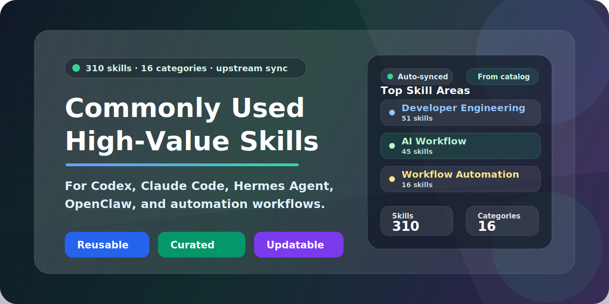

# Commonly Used High-Value Skills



[](./README.md)
[](./README.en.md)
[](./openclaw-skills/README.md)
[](./skills/)

面向中文 AI 开发者的高价值 Skills 仓库，覆盖开发工程、DevOps、产品设计、运营、办公自动化、金融投资、AI 平台与安全治理等高频任务场景。当前共 **15 个分类 / 188 个技能**。

## 为什么值得收藏

- 一次收齐高频可复用 Skills，减少到处找 prompt、脚本和工作流的时间。
- 同时兼容 `Codex`、`Claude Code`、`Hermes Agent`、`OpenClaw` 等多种 AI 工具使用方式。
- 按场景分类组织，既适合日常检索，也适合二次扩展和团队沉淀。
- 很多技能不只是文档，还带 `scripts/`、`references/`、`assets/`，可以直接复用。
- 仓库已经具备发现新 Skill、同步上游更新、候选优选、质量校验和生成视图的自动化链路，适合持续运营而不是一次性收集。
- 现在支持用策略文件对白名单来源、黑名单来源、优先来源和基础门槛做统一治理，优选结果更稳定、更可控。
- 已提供 `scripts/sync_codex_skills.py`，可以把仓库中的最新技能一键同步到本地 `Codex` 技能目录，减少手工拷贝和版本漂移。
- 除了功能覆盖，仓库也重视安全与可信度：既有来源追踪、候选筛选与安装前风险识别能力，也内置 `skill-vetter`、`skill-security-auditor`、`input-guard`、`link-checker` 等安全审查类技能。
- 现在还内置了许可证审计与月度死链巡检：`repo-validation` 会阻止缺失 license 元数据的外源技能进入主分支，`dead-links` 工作流会按月生成外链巡检报告。
- `Hermes Agent` 也被作为一等支持对象维护：可直接使用 `skills/` 分类目录，并且仓库已包含 `hermes-agent`、`native-mcp`、`hermes-graphify-gsd-*` 等 Hermes 生态专用技能。

## 适合谁

- 中文 AI 开发者和自动化工作流使用者
- 想把常见任务沉淀为 Skills 的个人或团队
- 正在使用 `Codex`、`Claude Code`、`Hermes Agent`、`OpenClaw` 等工具的工程师
- 想搭建一个自己的高价值技能库、提示库、Agent 工作流库的人

## 快速开始

### 我应该用哪个目录

| 使用场景 | 应使用的目录 |
|----------|---------------|
| `Codex` / `Claude Code` / `Hermes Agent` / 按源码浏览的 AI coding assistants | `skills/` |
| `OpenClaw` | `openclaw-skills/` |

### 方式一：直接发给 AI 工具的安装提示词（推荐）

如果你希望让 AI 工具直接帮你安装，优先发这段短提示词：

```
你现在是我的本地安装助手，请把这个仓库 https://github.com/seaworld008/Commonly-used-high-value-skills 里的 Skills 安装到当前 AI 工具中。
```

如果 AI 工具没有自动识别出来，再补一句即可：

```text
当前工具是 `<Codex / Claude Code / Hermes Agent / Cursor / OpenClaw>`，本地仓库路径是 `<你的本地仓库路径>`。
```

之所以可以这样简化，是因为仓库里已经包含给 AI 工具读取的安装规则与目录约定文档，通常不需要你手动把安装逻辑全部写进提示词里。

### 方式二：手动安装步骤

1. 克隆本仓库到本地。
2. 判断你当前使用的是哪类工具：
   - 如果是 `Codex` / `Claude Code` / `Hermes Agent` / `Cursor` / 其他源码浏览型 AI coding assistant，直接使用 `skills/`
   - 如果是 `OpenClaw`，使用 `openclaw-skills/`
3. 如果你使用 `OpenClaw`，先生成扁平导出目录：

```bash
python3 scripts/export_openclaw_skills.py
```

4. 把对应目录配置到你的 AI 工具里：
   - `Codex` / `Claude Code` / `Hermes Agent` / `Cursor`：配置 `skills/`
   - `OpenClaw`：配置 `openclaw-skills/`
5. 任选几个技能目录检查是否能正常读取，例如：
   - `skills/developer-engineering/codebase-onboarding`
   - `skills/security-and-reliability/skill-vetter`
   - `openclaw-skills/codebase-onboarding`

### 常见维护命令

如果你修改了仓库里的源码技能，推荐统一刷新生成视图：

```bash
python3 scripts/refresh_repo_views.py
```

如果你想在本地额外检查外源技能的许可证元数据与外链健康度，可以运行：

```bash
python3 scripts/audit_licenses.py
python3 scripts/check_dead_links.py --output docs/sources/reports/dead-links.json
```

如果你在本地 Codex skills 目录里看到 `invalid SKILL.md`、`missing YAML frontmatter`、`metadata` 类型错误等警告，可以运行：

```bash
python3 scripts/normalize_codex_skills.py ~/.codex/skills
```

Windows 示例：

```powershell
python scripts/normalize_codex_skills.py "C:\Users\admin\.codex\skills"
```

如果你想把仓库里的最新技能同步到本地 Codex 目录，可以运行：

```powershell
python scripts/sync_codex_skills.py --source-root "E:\AI-codex\003-Commonly-used-high-value-skills\skills" --codex-root "C:\Users\admin\.codex\skills"
```

## 分类快速跳转

| 分类 | 说明 | 文档跳转 | 目录 |
|------|------|----------|------|
| 开发工程 | 开发、测试、性能、代码审查、数据库与架构 | [跳转](#cat-developer-engineering) | [目录](./skills/developer-engineering/) |
| DevOps / SRE | 发布、监控、故障响应、CI/CD、环境管理 | [跳转](#cat-devops-sre) | [目录](./skills/devops-sre/) |
| 增长运营 | 小红书、社媒、内容、归因、竞品分析 | [跳转](#cat-growth-operations) | [目录](./skills/growth-operations-xiaohongshu/) |
| 金融投资 | 金融数据、估值、风控、回测、投研写作 | [跳转](#cat-finance-investing) | [目录](./skills/finance-investing/) |
| 办公与文档 | Word、Excel、PPT、PDF、会议纪要 | [跳转](#cat-office-white-collar) | [目录](./skills/office-white-collar/) |
| 记忆与安全 | 输入防护、RAG、Runbook | [跳转](#cat-memory-safety) | [目录](./skills/openclaw-memory-and-safety/) |
| 通用运营 | 品牌、事实核查、内沟通、主题与天气 | [跳转](#cat-operations-general) | [目录](./skills/operations-general/) |
| 产品与设计 | 产品分析、设计系统、UX 研究、SaaS 脚手架 | [跳转](#cat-product-design) | [目录](./skills/product-design/) |
| 任务理解与拆解 | brainstorming、research、plans、skills 搜索 | [跳转](#cat-task-understanding) | [目录](./skills/task-understanding-decomposition/) |
| AI 平台与 Agent 开发 | ChatGPT Apps、Figma、OpenAI Docs、自主 Agent | [跳转](#cat-ai-agent-platform) | [目录](./skills/ai-agent-platform/) |
| 工程工作流自动化 | 浏览器自动化、GitHub、Notebook、Playwright | [跳转](#cat-workflow-automation) | [目录](./skills/engineering-workflow-automation/) |
| 项目管理与知识库集成 | Notion、Linear、规格到实施 | [跳转](#cat-knowledge-pm) | [目录](./skills/knowledge-and-pm-integrations/) |
| 部署平台 | Cloudflare、Netlify、Render、Vercel | [跳转](#cat-deployment-platforms) | [目录](./skills/deployment-platforms/) |
| 多模态内容 | 图像、语音、视频、截图、摘要、转写 | [跳转](#cat-multimodal-media) | [目录](./skills/multimodal-media/) |
| 安全治理与稳定性 | Sentry、安全最佳实践、威胁建模 | [跳转](#cat-security-reliability) | [目录](./skills/security-and-reliability/) |

## 从哪里开始最容易上手

如果你是第一次来到这个仓库，推荐从下面几类开始：

- 开发提效：`developer-engineering`
- 工作流自动化：`engineering-workflow-automation`
- 金融投研和分析：`finance-investing`
- 知识库与项目流转：`knowledge-and-pm-integrations`
- 多模态生产力：`multimodal-media`

你也可以优先看这些代表性技能：

- `codebase-onboarding`
- `gh-fix-ci`
- `financial-data-collector`
- `portfolio-risk-manager`
- `notion-spec-to-implementation`
- `transcribe`

## Hermes + graphify + GSD 使用说明

这组最新技能包现在包含 4 个相关技能，详细用法已放到对应分类 README 中，主 README 只保留入口：

- 全局非侵入式工作流：[`hermes-graphify-gsd-nonintrusive-workflow`](./skills/ai-agent-platform/README.md#hermes-graphify-gsd-global-workflow)
- 运行态排障与 operator：[`hermes-graphify-gsd-runtime-operator`](./skills/ai-agent-platform/README.md#hermes-graphify-gsd-runtime-operator)
- 项目接入工作流：[`hermes-graphify-gsd-project-integration`](./skills/engineering-workflow-automation/README.md#hermes-graphify-gsd-project-workflow)
- brownfield 启动流程：[`gsd-graphify-brownfield-bootstrap`](./skills/engineering-workflow-automation/README.md#gsd-graphify-brownfield-bootstrap)

## Hermes Agent 支持

这个仓库不只是“包含几个 Hermes 相关技能”，而是把 `Hermes Agent` 作为正式支持的消费端之一来维护：

- 安装目录与 `Codex` / `Claude Code` 一致，统一使用 `skills/`
- 已内置 [`hermes-agent`](./skills/ai-agent-platform/hermes-agent/) 技能，覆盖 CLI、gateway、profiles、memory、skills、MCP 与贡献开发说明
- 已内置 [`native-mcp`](./skills/ai-agent-platform/native-mcp/) 技能，方便 Hermes 连接外部 MCP server
- 已内置 `hermes-graphify-gsd-*` 系列技能，支持把 Hermes 与 graphify、GSD 组合成自动化开发工作流

如果你是 Hermes 用户，推荐从这些入口开始：

- [`skills/ai-agent-platform/hermes-agent`](./skills/ai-agent-platform/hermes-agent/)
- [`skills/ai-agent-platform/native-mcp`](./skills/ai-agent-platform/native-mcp/)
- [`skills/ai-agent-platform/README.md`](./skills/ai-agent-platform/README.md)

## 如何参与共建

如果你希望把这个仓库一起做成更强的公共 Skills 基础设施：

- 阅读 [CONTRIBUTING.md](./CONTRIBUTING.md)
- 按 `skills/<分类>/<skill-name>/SKILL.md` 结构新增技能
- 修改后运行 `python3 scripts/refresh_repo_views.py`
- 提交 PR 时附上验证命令和适用场景

## 精选分类

- `developer-engineering`：开发工程、测试、代码审查、性能与架构
- `engineering-workflow-automation`：GitHub、CI、浏览器自动化、Notebook
- `finance-investing`：金融分析、数据采集、组合风险、回测、投研写作
- `knowledge-and-pm-integrations`：Notion、Linear 等知识与项目流转
- `multimodal-media`：图像、语音、视频、截图、转写
- `security-and-reliability`：Sentry、安全检查、威胁建模、所有权分析

## 仓库定位

如果你想找的是：

- 可复用的 AI Skills 模板
- 面向真实工作的 Agent 工作流
- 多客户端兼容的 Skills 组织方式
- 一个可以持续扩展成“明星仓库”的 Skills 基础设施

这个仓库就是为这类目标准备的。

## 如果这个仓库对你有帮助

- 欢迎点一个 Star，让更多 AI 开发者更容易发现它
- 欢迎提 PR，把你自己的高价值技能沉淀进来
- 欢迎分享给使用 `Codex`、`Claude Code`、`Hermes Agent`、`OpenClaw` 的朋友或团队

## 仓库目标

- 沉淀高复用、可组合的技能模块（Skills）。
- 通过统一目录和文档结构，降低检索和使用成本。
- 让常见任务可以快速匹配到可执行的方法与模板。

## 多客户端兼容安装

这个仓库现在提供两套消费入口，用来兼容不同 AI 客户端的技能发现方式：

| 客户端 | 应使用的目录 | 原因 |
|--------|---------------|------|
| `Codex` / `Claude Code` / `Hermes Agent` / 其他按源码浏览的 coding assistants | `skills/` | 保留分类结构，便于检索、维护与编辑 |
| `OpenClaw` | `openclaw-skills/` | OpenClaw 需要扁平的一层技能目录，不能直接识别 `skills/<分类>/<skill>` |

### 给 AI 机器人看的规则

仓库根目录新增了 [AGENTS.md](/Volumes/soft/13-openclaw%20安装部署/5-Commonly-used-high-value-skills/Commonly-used-high-value-skills/AGENTS.md)，明确约束如下：

- `OpenClaw` 安装时必须使用 `openclaw-skills/`
- `Codex`、`Claude Code`、`Hermes Agent` 等按原方式使用 `skills/`
- 不要把 `OpenClaw` 指向仓库根目录或 `skills/`
- `openclaw-skills/` 不手改，统一通过脚本生成

### OpenClaw 推荐接入方式

1. 克隆本仓库。
2. 生成或刷新 OpenClaw 兼容目录：

```bash
python3 scripts/export_openclaw_skills.py
```

3. 在 OpenClaw 配置里把克隆仓库的 `openclaw-skills/` 加到 `skills.load.extraDirs`。
4. 用下面命令确认是否已识别：

```bash
openclaw skills list
openclaw skills check
```

## 目录结构

```text
skills/
  ai-agent-platform/                  # AI 平台与 Agent 开发
  customized-solutions/               # 预留的定制化方案分类（当前为空）
  deployment-platforms/               # 部署平台（Vercel/Netlify/Render/Cloudflare）
  developer-engineering/              # 开发工程
  devops-sre/                         # DevOps / SRE
  engineering-workflow-automation/    # 工程工作流自动化（GitHub/CI/测试）
  finance-investing/                  # 金融投资与投研分析
  growth-operations-xiaohongshu/      # 增长运营（小红书/社媒）
  knowledge-and-pm-integrations/      # 项目管理与知识库集成（Linear/Notion）
  multimodal-media/                   # 多模态内容（图像/语音/视频/转写）
  office-white-collar/                # 办公与文档生产力
  openclaw-memory-and-safety/         # 记忆与安全
  operations-general/                 # 通用运营
  product-design/                     # 产品与设计
  security-and-reliability/           # 安全治理与稳定性
  task-understanding-decomposition/   # 任务理解与拆解
openclaw-skills/                      # 为 OpenClaw 生成的扁平兼容导出目录
```

## 使用方式

1. 按分类进入目标目录（如 `skills/developer-engineering/`）。
2. 打开对应技能的 `SKILL.md` 查看触发条件、操作流程和脚本说明。
3. 若技能下含 `scripts/`、`references/`、`assets/`，优先复用现成内容。

## 技能总览（按分类，15 类 / 188 技能）

<a id="cat-developer-engineering"></a>
### 1. 开发工程（developer-engineering，40）

- `agent-designer`：用于设计和评估多智能体系统架构。
- `api-design-reviewer`：用于审查 API 设计规范、可维护性与一致性。
- `api-test-suite-builder`：用于构建 API 自动化测试套件。
- `cli-demo-generator`：用于生成命令行工具演示与示例流程。
- `codebase-onboarding`：用于快速理解陌生代码库结构与关键模块。
- `database-designer`：用于数据库建模与表结构设计。
- `database-schema-designer`：用于设计或优化数据库 Schema。
- `dependency-auditor`：用于依赖审计、漏洞排查与许可证检查。
- `frontend-design`：用于前端界面设计实现与体验优化。
- `git-worktree-manager`：用于管理 Git Worktree 并行开发工作流。
- `github-contributor`：用于规范化 GitHub 贡献流程（Issue/PR/协作）。
- `i18n-expert`：用于国际化与本地化能力建设。
- `mcp-builder`：用于搭建 MCP 工具与集成能力。
- `mcp-server-builder`：用于构建和调试 MCP Server。
- `migration-architect`：用于制定数据或系统迁移方案。
- `monorepo-navigator`：用于在 Monorepo 中快速定位代码与依赖关系。
- `performance-profiler`：用于性能剖析、瓶颈定位与优化建议。
- `pr-review-expert`：用于提升 Pull Request 审查质量。
- `promptfoo-evaluation`：用于提示词/模型输出评测与对比。
- `qa-expert`：用于测试策略制定与质量保障。
- `repomix-safe-mixer`：用于安全打包与整理仓库上下文。
- `skill-tester`：用于技能可用性测试与效果验证。
- `tech-debt-tracker`：用于识别、记录和治理技术债。
- `web-artifacts-builder`：用于构建和管理前端制品。
- `webapp-testing`：用于 Web 应用自动化测试与回归验证。
- `aws-solution-architect`：用于 AWS 云架构设计、服务选型与 Well-Architected Framework 评估。
- `context-engineering`：用于 AI 编码助手的上下文优化、Prompt 结构设计和指令冲突防御。
- `docker-expert`：用于 Docker 容器化最佳实践、多阶段构建优化与 Compose 编排。
- `graphql-expert`：用于 GraphQL API 设计、查询优化、Schema 管理和安全最佳实践。
- `kubernetes-specialist`：用于 K8s 集群管理、部署编排、Pod 调试与 Helm Chart 设计。
- `nextjs-app-router`：用于 Next.js App Router 模式开发，包含 RSC 与 Server Actions。
- `python-performance`：用于 Python 性能优化、内存分析和并发编程最佳实践。
- `rust-engineer`：用于 Rust 语言开发最佳实践、异步编程和系统级编程指导。
- `supabase-postgres`：用于 Supabase 平台开发与 PostgreSQL 最佳实践。
- `systematic-debugging`：用于系统化调试方法论，包含根因分析与最小复现。
- `tailwind-design-system`：用于 Tailwind CSS 设计系统搭建与主题定制。
- `terraform-engineer`：用于 Terraform IaC 设计、模块化管理和状态管理。
- `test-driven-development`：用于 TDD 红绿重构循环与测试策略制定。
- `typescript-best-practices`：用于 TypeScript 高级类型编程与类型安全设计。

<a id="cat-devops-sre"></a>
### 2. DevOps / SRE（devops-sre，10）

- `changelog-generator`：用于自动生成版本变更日志。
- `ci-cd-pipeline-builder`：用于设计与搭建 CI/CD 流水线。
- `cloudflare-troubleshooting`：用于 Cloudflare 常见问题排查。
- `env-secrets-manager`：用于环境变量与密钥管理。
- `github-ops`：用于 GitHub 运维与仓库流程自动化。
- `incident-commander`：用于事故响应、升级与复盘流程。
- `observability-designer`：用于监控、告警和 SLO 体系设计。
- `release-manager`：用于发布节奏、版本流程与变更管控。
- `senior-devops`：用于综合 DevOps 工程实践与体系落地。
- `senior-architect`：用于软件架构评审、技术选型决策和系统可扩展性分析。

<a id="cat-growth-operations"></a>
### 3. 增长运营（growth-operations-xiaohongshu，11）

- `algorithmic-art`：用于生成算法风格视觉内容与创意素材。
- `app-store-optimization`：用于应用商店优化（ASO）与关键词策略。
- `campaign-analytics`：用于活动归因分析与 ROI 评估。
- `competitors-analysis`：用于竞品信息采集与对标分析。
- `content-creator`：用于内容策划、脚本与发布节奏设计。
- `marketing-demand-acquisition`：用于获客漏斗与需求增长策略。
- `marketing-strategy-pmm`：用于市场定位、信息传达与 PMM 策略。
- `prompt-engineer-toolkit`：用于运营场景下的提示词工程实践。
- `social-media-analyzer`：用于社媒数据分析与趋势洞察。
- `twitter-reader`：用于读取、整理和提炼 Twitter 信息。
- `seo-audit`：用于网站 SEO 全面审计、On-page 优化建议和技术 SEO 检查。

<a id="cat-finance-investing"></a>
### 4. 金融投资（finance-investing，13）

- `comps-valuation-analyst`：用于可比公司估值、倍数区间分析与相对估值判断。
- `earnings-call-analyzer`：用于财报电话会摘要、管理层口径变化和风险信号提取。
- `event-driven-tracker`：用于跟踪财报、并购、回购、分红等重要事件催化剂。
- `factor-backtester`：用于因子策略回测、收益拆解、换手与成本敏感性检查。
- `financial-analyst`：用于财务分析、预测与报告输出。
- `financial-data-collector`：用于财务数据抓取、清洗与校验。
- `investment-memo-writer`：用于把研究结论整理成投委会或投资备忘录。
- `macro-regime-monitor`：用于宏观 regime 跟踪与风险偏好框架判断。
- `options-strategy-evaluator`：用于期权策略盈亏结构、风险点和情景分析。
- `portfolio-risk-manager`：用于组合风险、暴露、集中度与 Beta 视角分析。
- `sec-filing-reviewer`：用于审阅 SEC 披露文件并提取核心风险线索。
- `stock-screener-builder`：用于构建选股条件、筛选股票池与生成研究 shortlist。
- `saas-metrics-coach`：用于 SaaS 关键指标分析与健康度诊断（ARR/MRR/Churn/LTV/CAC）。

<a id="cat-office-white-collar"></a>
### 5. 办公与文档（office-white-collar，16）

- `capture-screen`：用于系统级截图与区域截图。
- `doc`：用于 `.docx` 文档的读取、创建与编辑（偏工作流编排）。
- `doc-coauthoring`：用于文档协同编辑与审阅流程。
- `docx`：用于 Word（.docx）文档创建、编辑与分析。
- `excel-automation`：用于 Excel 自动化处理与批量操作。
- `gog`：用于 Google Workspace（Gmail/Calendar/Drive/Docs）自动化办公。
- `markdown-tools`：用于 Markdown 转换、合并和内容处理。
- `meeting-minutes-taker`：用于会议纪要结构化整理。
- `mermaid-tools`：用于 Mermaid 图表提取、生成与渲染。
- `pdf`：用于 PDF 的读取、解析和内容处理。
- `pdf-creator`：用于从 Markdown/文本生成 PDF。
- `ppt-creator`：用于快速生成演示文稿内容。
- `pptx`：用于 PPTX 文件编辑、清理与结构操作。
- `spreadsheet`：用于电子表格（xlsx/csv/tsv）通用处理与分析。
- `transcript-fixer`：用于转录文本纠错、对比与修订。
- `xlsx`：用于电子表格分析、公式与格式处理。

<a id="cat-memory-safety"></a>
### 6. 记忆与安全（openclaw-memory-and-safety，3）

- `input-guard`：用于检测外部文本中的提示注入风险。
- `rag-architect`：用于 RAG 系统架构设计与评估。
- `runbook-generator`：用于生成标准化运维 Runbook。

<a id="cat-operations-general"></a>
### 7. 通用运营（operations-general，11）

- `brand-guidelines`：用于品牌规范制定与统一表达。
- `docs-cleaner`：用于文档清洗、重构与降噪。
- `fact-checker`：用于信息事实核查与可信度评估。
- `internal-comms`：用于内部沟通文案与公告写作。
- `interview-system-designer`：用于面试流程、题库与评估体系设计。
- `slack-gif-creator`：用于制作 Slack 场景 GIF 素材。
- `teams-channel-post-writer`：用于撰写 Teams 频道发布文案。
- `theme-factory`：用于主题风格配置与视觉模板输出。
- `weather`：用于免 API Key 的天气查询与出行场景支持。
- `supermemory`：用于长期记忆管理、偏好捕获和矛盾检测。
- `confidence-check`：用于结构化自我审查，验证假设和减少幻觉输出。

<a id="cat-product-design"></a>
### 8. 产品与设计（product-design，10）

- `agile-product-owner`：用于敏捷需求管理与迭代推进。
- `canvas-design`：用于商业/产品画布设计与梳理。
- `competitive-teardown`：用于产品竞品拆解分析。
- `product-analysis`：用于产品诊断、问题分析与优化建议。
- `product-manager-toolkit`：用于产品经理常用方法与模板。
- `product-strategist`：用于产品战略规划与路线图设计。
- `saas-scaffolder`：用于 SaaS 产品方案脚手架与初始结构。
- `ui-design-system`：用于 UI 设计系统与 Design Token 规范。
- `ux-researcher-designer`：用于用户研究与体验设计方法。
- `landing-page-generator`：用于快速生成高转化率落地页结构与 TSX/Tailwind 代码脚手架。

<a id="cat-task-understanding"></a>
### 9. 任务理解与拆解（task-understanding-decomposition，12）

- `agent-workflow-designer`：用于设计 Agent 协作流程与分工。
- `brainstorming`：用于在实现前进行需求澄清与方案发散。
- `deep-research`：用于深度研究、证据汇总与结论输出。
- `find-skills`：用于自动检索并安装目标任务所需技能。
- `prompt-optimizer`：用于优化提示词结构与效果。
- `reflect-learn`：用于复盘总结并沉淀可复用经验。
- `skill-creator`：用于新技能创建、迭代与评测。
- `skill-reviewer`：用于技能质量评审与改进建议。
- `skills-search`：用于快速检索并匹配可用技能。
- `tavily-search`：用于联网实时检索与来源证据补充。
- `writing-plans`：用于编写可执行的实施计划。
- `subagent-driven-development`：用于多子 Agent 并行开发编排与两阶段审查。

<a id="cat-ai-agent-platform"></a>
### 10. AI 平台与 Agent 开发（ai-agent-platform，8）

- `chatgpt-apps`：用于构建、脚手架化和调试 ChatGPT Apps。
- `develop-web-game`：用于 Web 游戏快速迭代开发与自动化验证。
- `figma`：用于通过 Figma MCP 获取设计上下文与资源信息。
- `figma-implement-design`：用于把 Figma 节点高保真转成可生产代码。
- `openai-docs`：用于基于 OpenAI 官方文档进行能力检索与实现指导。
- `proactive-agent`：用于提升 Agent 主动规划与持续协作能力。
- `self-improving-agent`：用于记忆驱动的反思迭代与自我优化。
- `agent-hub`：用于多 Agent 系统编排、通信协议设计与生命周期管理。

<a id="cat-workflow-automation"></a>
### 11. 工程工作流自动化（engineering-workflow-automation，8）

- `agent-browser`：用于语义驱动的真实浏览器自动化操作。
- `gh-address-comments`：用于处理 GitHub PR 的 review/issue 评论并闭环。
- `gh-fix-ci`：用于诊断并修复 GitHub Actions CI 失败。
- `jupyter-notebook`：用于创建和维护实验分析类 Notebook。
- `playwright`：用于终端驱动的真实浏览器自动化测试与排查。
- `github`：用于通过 GitHub CLI 管理 Issues、PR 与 CI 自动化协作。
- `yeet`：用于一体化执行 stage/commit/push/PR 流程。
- `web-scraper`：用于网页数据抓取、结构化提取和反爬策略应对。

<a id="cat-knowledge-pm"></a>
### 12. 项目管理与知识库集成（knowledge-and-pm-integrations，5）

- `linear`：用于 Linear 任务与项目流程管理。
- `notion-knowledge-capture`：用于将讨论沉淀为结构化 Notion 知识页。
- `notion-meeting-intelligence`：用于基于 Notion 上下文准备会议材料。
- `notion-research-documentation`：用于跨 Notion 页面研究并汇总文档。
- `notion-spec-to-implementation`：用于把 Notion 规格转为实施计划与任务。

<a id="cat-deployment-platforms"></a>
### 13. 部署平台（deployment-platforms，4）

- `cloudflare-deploy`：用于部署到 Cloudflare Workers/Pages 等平台。
- `netlify-deploy`：用于通过 Netlify CLI 发布站点。
- `render-deploy`：用于在 Render 上生成和部署应用蓝图。
- `vercel-deploy`：用于在 Vercel 上进行预览和生产部署。

<a id="cat-multimodal-media"></a>
### 14. 多模态内容（multimodal-media，6）

- `imagegen`：用于图像生成、编辑、抠图和变体产出。
- `screenshot`：用于系统级截图采集（全屏/窗口/区域）。
- `sora`：用于 Sora 视频生成、轮询、下载与管理。
- `speech`：用于文本转语音旁白生成。
- `summarize`：用于网页、文档与长文本内容摘要。
- `transcribe`：用于音视频转写与可选说话人区分。

<a id="cat-security-reliability"></a>
### 15. 安全治理与稳定性（security-and-reliability，7）

- `link-checker`：用于 URL 安全检测、钓鱼链接识别与基础可达性检查。
- `security-best-practices`：用于按语言/框架执行安全最佳实践检查。
- `security-ownership-map`：用于基于 Git 历史构建安全责任与 Bus Factor 图谱。
- `security-threat-model`：用于仓库级威胁建模与缓解建议输出。
- `sentry`：用于读取并汇总 Sentry 线上异常与健康信息。
- `skill-vetter`：用于安装前技能安全审计与风险识别。
- `skill-security-auditor`：用于第三方 Skill 安装前安全扫描（命令注入/数据泄露/提示注入检测）。

## 建议补充的高热度技能（候选）

以下技能是建议纳入下一批扩充的候选项，当前 **尚未** 在 `skills/` 目录中落地，因此 **不计入** 上方的 `15 类 / 188 技能` 统计。

如需继续扩充，建议下一批优先关注：

- `link-checker`（2.1K 下载）：建议归类到 `security-and-reliability`，用于 URL 安全检测、钓鱼链接识别与基础可达性检查。

### 工程工作流与协作（仍在候选）

- `github`（24.8K 下载）：建议归类到 `engineering-workflow-automation`，用于通过 GitHub CLI 管理 Issues、PRs 和 CI 运行；可与 `gh-address-comments`、`gh-fix-ci`、`yeet` 形成互补。

## 快速检索命令

```bash
# 列出所有技能定义文件
rg --files skills | rg "SKILL.md$"

# 按关键词查找技能
rg -n "prompt|security|pdf|deploy" skills/**/SKILL.md
```

## 维护建议

- 新增技能时保持 `skills/<分类>/<skill-name>/SKILL.md` 结构。
- OpenClaw 兼容目录通过 `python3 scripts/export_openclaw_skills.py` 生成，不直接手工维护 `openclaw-skills/`。
- 若将候选技能正式落地，请同步把对应条目从“建议补充的高热度技能（候选）”迁移到正式分类列表，并更新总数统计。
- 每个技能应提供清晰触发条件、步骤、边界和验证方式。
- 优先复用 `scripts/` 与 `references/`，减少重复实现。
- 版本新鲜度校验建议采用“离线快照 + 本地比对”，避免逐个技能联网探测触发风控：

```bash
# 1) 快速生成 snapshot 模板（最小示例）
python3 scripts/skill_snapshot_template.py generate --output /tmp/clawhub_skills_snapshot.json

# 2) 用本仓库当前技能一键生成 snapshot（推荐）
python3 scripts/skill_snapshot_template.py generate --output /tmp/clawhub_skills_snapshot.json --from-local

# 3) 校验 snapshot 结构是否合法
python3 scripts/skill_snapshot_template.py validate --snapshot /tmp/clawhub_skills_snapshot.json

# 4) 再做离线新鲜度比对
python3 scripts/audit_skill_freshness.py --snapshot /tmp/clawhub_skills_snapshot.json
```

---

如果你希望，我可以在下一步继续补一版 `README.zh-CN.md`（面向中文）+ `README.en.md`（面向国际协作），并自动校验两份目录与技能数量一致。
