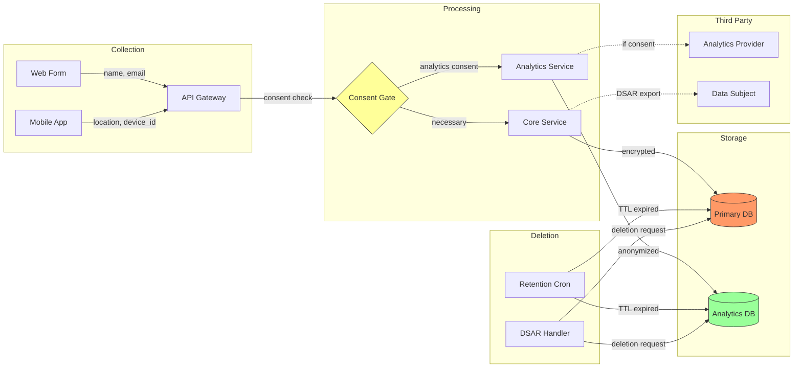

# Privacy Implementation Patterns

## Consent Management

### Consent Collection (React + TypeScript)

```typescript
// Granular consent model — each purpose is a separate toggle
interface ConsentPreferences {
  necessary: true; // Always true, not toggleable
  analytics: boolean;
  marketing: boolean;
  personalization: boolean;
  thirdPartySharing: boolean;
}

interface ConsentRecord {
  userId: string;
  preferences: ConsentPreferences;
  version: string; // Policy version at time of consent
  collectedAt: Date;
  method: 'banner' | 'settings' | 'signup';
  ipAddress?: string; // For proof of consent (GDPR Art. 7)
}

// Consent gate — wrap data processing in consent checks
function withConsent<T>(
  purpose: keyof ConsentPreferences,
  action: () => T,
  fallback: T
): T {
  const consent = getStoredConsent();
  if (consent?.preferences[purpose]) {
    return action();
  }
  return fallback;
}
```

### Consent Propagation (Backend)

```typescript
// Middleware: attach consent context to request
function consentMiddleware(req: Request, res: Response, next: NextFunction) {
  const consentToken = req.headers['x-consent-token'];
  if (consentToken) {
    req.consent = verifyConsentToken(consentToken);
  } else {
    req.consent = { necessary: true }; // Minimum default
  }
  next();
}

// Service: check consent before processing
class AnalyticsService {
  track(event: AnalyticsEvent, consent: ConsentPreferences): void {
    if (!consent.analytics) {
      return; // Silently skip — no error, no logging of the event
    }
    this.provider.track(event);
  }
}
```

## PII Redaction Middleware

### Log Redaction

```typescript
// Patterns to redact in log output
const PII_PATTERNS: Array<{ pattern: RegExp; replacement: string }> = [
  { pattern: /[a-zA-Z0-9._%+-]+@[a-zA-Z0-9.-]+\.[a-zA-Z]{2,}/g, replacement: '[EMAIL]' },
  { pattern: /\b\d{3}-?\d{2}-?\d{4}\b/g, replacement: '[SSN]' },
  { pattern: /\b(?:4\d{12}(?:\d{3})?|5[1-5]\d{14}|3[47]\d{13})\b/g, replacement: '[CARD]' },
  { pattern: /\+?[1-9]\d{6,14}/g, replacement: '[PHONE]' },
  { pattern: /\b\d{3}-?\d{4}\b/g, replacement: '[POSTAL]' }, // Japanese postal
];

function redactPII(message: string): string {
  let redacted = message;
  for (const { pattern, replacement } of PII_PATTERNS) {
    redacted = redacted.replace(pattern, replacement);
  }
  return redacted;
}

// Winston transport with PII redaction
const privacySafeFormat = winston.format((info) => {
  info.message = redactPII(info.message);
  if (info.metadata) {
    info.metadata = JSON.parse(redactPII(JSON.stringify(info.metadata)));
  }
  return info;
});
```

### API Response Filtering

```typescript
// Field-level PII stripping based on caller's authorization
type PIILevel = 'full' | 'partial' | 'anonymous';

function filterUserResponse(user: User, level: PIILevel): Partial<User> {
  switch (level) {
    case 'full':
      return user; // Internal admin only
    case 'partial':
      return {
        id: user.id,
        displayName: user.displayName,
        email: maskEmail(user.email), // j***@example.com
        createdAt: user.createdAt,
      };
    case 'anonymous':
      return {
        id: hashId(user.id), // One-way hash
        createdAt: user.createdAt,
      };
  }
}

function maskEmail(email: string): string {
  const [local, domain] = email.split('@');
  return `${local[0]}${'*'.repeat(Math.max(local.length - 1, 2))}@${domain}`;
}
```

## DSAR (Data Subject Access Request) Handler

### Access Request (Art. 15 / §1798.100)

```typescript
interface DSARRequest {
  type: 'access' | 'deletion' | 'rectification' | 'portability' | 'restriction';
  subjectId: string;
  verifiedAt: Date;
  deadline: Date; // 30 days (GDPR) or 45 days (CCPA) from verification
}

async function handleAccessRequest(req: DSARRequest): Promise<DSARResponse> {
  // 1. Collect data from all services
  const userData = await Promise.all([
    userService.getProfile(req.subjectId),
    orderService.getOrders(req.subjectId),
    analyticsService.getEvents(req.subjectId),
    supportService.getTickets(req.subjectId),
  ]);

  // 2. Format as machine-readable export
  const exportData = {
    exportedAt: new Date().toISOString(),
    dataSubject: req.subjectId,
    categories: {
      profile: userData[0],
      transactions: userData[1],
      analytics: userData[2],
      support: userData[3],
    },
  };

  // 3. Log the request fulfillment (without PII)
  auditLog.record({
    action: 'DSAR_ACCESS_FULFILLED',
    subjectId: hashId(req.subjectId),
    categories: Object.keys(exportData.categories),
    fulfilledAt: new Date(),
  });

  return { format: 'json', data: exportData };
}
```

### Deletion Request (Art. 17 / §1798.105)

```typescript
async function handleDeletionRequest(req: DSARRequest): Promise<void> {
  // 1. Check for legal holds / retention obligations
  const holds = await legalHoldService.check(req.subjectId);
  if (holds.length > 0) {
    throw new DSARException('LEGAL_HOLD', holds);
  }

  // 2. Cascade deletion across all services
  const deletionPlan = [
    { service: 'user', action: () => userService.delete(req.subjectId) },
    { service: 'orders', action: () => orderService.anonymize(req.subjectId) }, // Keep for accounting, remove PII
    { service: 'analytics', action: () => analyticsService.purge(req.subjectId) },
    { service: 'support', action: () => supportService.anonymize(req.subjectId) },
    { service: 'backups', action: () => backupService.scheduleRedaction(req.subjectId) },
  ];

  const results = await Promise.allSettled(
    deletionPlan.map(async (step) => {
      await step.action();
      return { service: step.service, status: 'deleted' };
    })
  );

  // 3. Notify processors (Art. 17(2))
  await notifyProcessors(req.subjectId, 'deletion');

  // 4. Audit trail
  auditLog.record({
    action: 'DSAR_DELETION_FULFILLED',
    subjectId: hashId(req.subjectId), // Keep hashed reference only
    services: results.map((r) => (r.status === 'fulfilled' ? r.value : { service: 'unknown', status: 'failed' })),
    fulfilledAt: new Date(),
  });
}
```

## Data Retention Enforcement

### TTL-Based Retention

```typescript
// Define retention policies per data category
const RETENTION_POLICIES: Record<string, { ttl: number; action: 'delete' | 'anonymize' }> = {
  'session_logs': { ttl: 90 * 24 * 60 * 60 * 1000, action: 'delete' },           // 90 days
  'analytics_events': { ttl: 365 * 24 * 60 * 60 * 1000, action: 'anonymize' },    // 1 year
  'user_accounts': { ttl: 30 * 24 * 60 * 60 * 1000, action: 'delete' },           // 30 days after deletion request
  'financial_records': { ttl: 7 * 365 * 24 * 60 * 60 * 1000, action: 'anonymize' }, // 7 years (legal)
};

// Cron job for retention enforcement
async function enforceRetention(): Promise<void> {
  for (const [category, policy] of Object.entries(RETENTION_POLICIES)) {
    const expiredRecords = await db.query(
      `SELECT id FROM ${category} WHERE created_at < $1`,
      [new Date(Date.now() - policy.ttl)]
    );

    if (policy.action === 'delete') {
      await db.query(`DELETE FROM ${category} WHERE id = ANY($1)`, [expiredRecords.map(r => r.id)]);
    } else {
      await anonymizeRecords(category, expiredRecords.map(r => r.id));
    }

    auditLog.record({
      action: 'RETENTION_ENFORCED',
      category,
      recordCount: expiredRecords.length,
      policy: policy.action,
    });
  }
}
```

## Pseudonymization & Anonymization

### Pseudonymization (Reversible with key)

```typescript
import { createCipheriv, createDecipheriv, randomBytes } from 'crypto';

// Pseudonymize: reversible with key — still personal data under GDPR
function pseudonymize(value: string, key: Buffer): string {
  const iv = randomBytes(16);
  const cipher = createCipheriv('aes-256-gcm', key, iv);
  const encrypted = Buffer.concat([cipher.update(value, 'utf8'), cipher.final()]);
  const tag = cipher.getAuthTag();
  return `${iv.toString('hex')}:${encrypted.toString('hex')}:${tag.toString('hex')}`;
}

function depseudonymize(token: string, key: Buffer): string {
  const [ivHex, encHex, tagHex] = token.split(':');
  const decipher = createDecipheriv('aes-256-gcm', key, Buffer.from(ivHex, 'hex'));
  decipher.setAuthTag(Buffer.from(tagHex, 'hex'));
  return decipher.update(Buffer.from(encHex, 'hex')) + decipher.final('utf8');
}
```

### Anonymization (Irreversible — no longer personal data)

```typescript
import { createHash } from 'crypto';

// k-anonymity: generalize quasi-identifiers
function generalizeAge(age: number): string {
  const bracket = Math.floor(age / 10) * 10;
  return `${bracket}-${bracket + 9}`;
}

function generalizePostalCode(code: string): string {
  return code.slice(0, 3) + '-****'; // Keep area, remove specific
}

// Differential privacy: add calibrated noise
function addLaplaceNoise(value: number, sensitivity: number, epsilon: number): number {
  const scale = sensitivity / epsilon;
  const u = Math.random() - 0.5;
  return value - scale * Math.sign(u) * Math.log(1 - 2 * Math.abs(u));
}
```

## Privacy-Safe Error Handling

```typescript
// NEVER include PII in error responses
class PrivacySafeError extends Error {
  constructor(
    public code: string,
    public userMessage: string, // Safe for client
    public internalContext?: Record<string, unknown> // Logged server-side only (redacted)
  ) {
    super(userMessage);
  }
}

// Error handler middleware
function privacyErrorHandler(err: Error, req: Request, res: Response, next: NextFunction) {
  if (err instanceof PrivacySafeError) {
    // Log internal context with PII redaction
    logger.error(redactPII(JSON.stringify({
      code: err.code,
      context: err.internalContext,
      requestId: req.id,
    })));

    // Return safe message to client
    res.status(getHttpStatus(err.code)).json({
      error: err.code,
      message: err.userMessage,
      requestId: req.id, // For support reference, not PII
    });
  } else {
    // Unknown error — never expose internals
    logger.error('Unhandled error', { requestId: req.id, stack: err.stack });
    res.status(500).json({
      error: 'INTERNAL_ERROR',
      message: 'An unexpected error occurred.',
      requestId: req.id,
    });
  }
}
```

## Data Flow Diagram Template (Mermaid)



## Cookie Consent Implementation

```typescript
// Cookie categories aligned with consent purposes
const COOKIE_CATEGORIES = {
  necessary: {
    cookies: ['session_id', 'csrf_token', 'consent_preferences'],
    description: 'Essential for site functionality',
    canDisable: false,
  },
  analytics: {
    cookies: ['_ga', '_gid', '_gat'],
    description: 'Help us understand site usage',
    canDisable: true,
  },
  marketing: {
    cookies: ['_fbp', '_gcl_au', 'ads_session_id'],
    description: 'Used for targeted advertising',
    canDisable: true,
  },
} as const;

// Block cookies until consent (GDPR-compliant)
function initializeTracking(consent: ConsentPreferences): void {
  // Only load analytics SDK if consented
  if (consent.analytics) {
    loadScript('https://www.googletagmanager.com/gtag/js');
  }
  // Only load marketing pixels if consented
  if (consent.marketing) {
    loadScript('https://connect.facebook.net/en_US/fbevents.js');
  }
}
```

## Database Schema Privacy Annotations

```sql
-- Privacy-aware schema with retention and classification comments
CREATE TABLE users (
    id UUID PRIMARY KEY DEFAULT gen_random_uuid(),
    -- PII:Personal, Basis:Contract, Retention:account_lifetime+30d
    email VARCHAR(255) NOT NULL,
    -- PII:Personal, Basis:Contract, Retention:account_lifetime+30d
    display_name VARCHAR(100),
    -- PII:Sensitive, Basis:Consent, Retention:until_revoked
    phone VARCHAR(20),
    -- Internal, Basis:Contract, Retention:account_lifetime
    created_at TIMESTAMPTZ NOT NULL DEFAULT NOW(),
    -- Internal, Basis:N/A, Retention:account_lifetime
    deleted_at TIMESTAMPTZ, -- Soft delete for retention period
    -- Consent tracking
    consent_version VARCHAR(20),
    consent_given_at TIMESTAMPTZ
);

-- Index for retention enforcement
CREATE INDEX idx_users_deleted_at ON users (deleted_at) WHERE deleted_at IS NOT NULL;

-- View for anonymized reporting (no PII exposed)
CREATE VIEW users_anonymized AS
SELECT
    md5(id::text) AS anonymous_id,
    date_trunc('month', created_at) AS signup_month,
    CASE WHEN deleted_at IS NOT NULL THEN 'churned' ELSE 'active' END AS status
FROM users;
```
