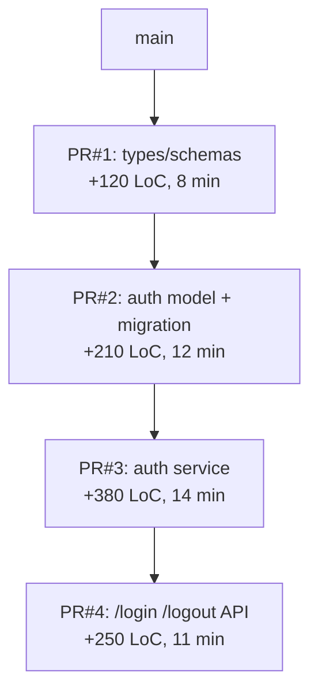

# PR Split Strategy Reference

Purpose: Decompose an M+ sized branch (200+ LoC, 11+ files) into a **stacked PR** series where each PR is independently reviewable in 10–15 minutes. Produces a dependency DAG, file-partition proposal, per-PR review-time estimate, and tool selection (Graphite / ghstack / git-town / jj / native `--update-refs`).

## Contents

- When to split
- Partition strategies
- Stacked PR tooling
- Workflow
- Command recipes
- Output template

## When to Split

Trigger split planning when any of the following hold:

| Signal | Threshold |
|--------|-----------|
| Total lines | ≥ 500 (L), must-split ≥ 1000 (XL), mandatory ≥ 3000 (XXL) |
| File count | ≥ 20 |
| Affected modules | ≥ 3 top-level |
| Commits | ≥ 10 and concerns are mixable |
| Review ETA | single review would exceed ~30 min |

Google benchmark: defect detection drops 70% above 1000 LoC; PRs < 300 LoC get 60% more thorough review.

## Partition Strategies

Choose the strategy whose axis best matches the branch's change shape. Combine strategies for complex branches.

### 1. Layer-based (bottom-up dependency)

```
PR #1: types / interfaces / schemas         (zero-dependency foundation)
PR #2: data layer (models, migrations)      (depends on #1)
PR #3: service / domain layer               (depends on #2)
PR #4: API / controller layer               (depends on #3)
PR #5: UI / frontend consumption            (depends on #4)
PR #6: tests (if not inlined per layer)     (depends on all)
```

Best for: full-stack features, new modules, green-field work.

### 2. Concern-based (orthogonal slices)

```
PR #1: feature flag + config infra
PR #2: test infrastructure / fixtures
PR #3: feature implementation (behind flag)
PR #4: documentation / changelog
PR #5: flag removal (after rollout)
```

Best for: features with rollout control, compliance-sensitive changes.

### 3. Risk-based (blast-radius sorted)

```
PR #1: pure additions (new files, new exports)         — lowest risk
PR #2: internal refactor (no public API change)        — medium
PR #3: public API additions                            — medium
PR #4: behavior modifications                          — higher
PR #5: deletions / migrations                          — highest
```

Best for: library/SDK work, critical-path systems, review-budget-constrained teams.

### 4. Strangler-fig (old → new cohabitation)

```
PR #1: introduce new implementation alongside old
PR #2: route one call-site to new
PR #3: route remaining call-sites incrementally
PR #N: delete old implementation
```

Best for: migrations, refactors of load-bearing code.

## Stacked PR Tooling

| Tool | Model | Strength | Weakness |
|------|-------|----------|----------|
| **Graphite** | SaaS CLI + web | Best UX, merge queue, CODEOWNERS-aware | Paid for teams, vendor lock-in |
| **ghstack** (Meta) | GitHub PR chains | Free, used at scale internally at Meta | No web UI, PR rebase friction |
| **git-town** | Git wrapper | Scriptable, opinionated workflows | Learning curve |
| **spr** (Google) | Phabricator-style | Single-commit-per-PR mental model | Less GitHub-native |
| **stack-pr** (Modular) | GitHub-native | Lightweight, Python-based | Younger ecosystem |
| **Aviator** | SaaS merge queue + stacks | Integrated merge queue, enterprise | Paid, heavier |
| **Jujutsu (jj)** | Git-compatible VCS | Native stacking via changeset model | New paradigm, repo-wide adoption needed |
| **git-branchless** | Monorepo-scale | High performance, dag manipulation | CLI complexity |
| **Native `git --update-refs`** | Git 2.38+ | Zero dependency | Manual conflict resolution per rebase |

Selection heuristic:
- Team already uses a tool → keep using it (switching cost > tool optimality)
- Free-tier solo / small team → `ghstack` or native `--update-refs`
- Monorepo with strict merge queue → Graphite or Aviator
- Adopting Jujutsu → `jj` native stacking
- One-off split, no tool investment → native `--update-refs`

## Workflow

```
SURVEY   → Collect branch size, commit shape, module touch map
CHOOSE   → Pick partition strategy (Layer / Concern / Risk / Strangler)
PARTITION → Assign commits/files to target PRs; validate dependency DAG
SIZE     → Estimate per-PR review time; rebalance if any PR > 15 min
ORDER    → Compute topological order; identify parallelizable branches
TOOL     → Recommend stacking tool based on team context
EMIT     → Per-PR branch names, base pointer, commit assignment, review ETA
```

### Dependency DAG Rules

- Each PR has exactly one parent base (its predecessor's head, or the main base).
- No cycles — if two PRs depend on each other, merge them into one.
- Parallel (non-dependent) PRs can share the same base → parallelizable review.
- Keep stack depth ≤ 5 — beyond that, rebase churn dominates.

### Per-PR Review Time Estimate

```
T_pr = 5 min (context) + 0.05 min × lines_changed + 2 min × files_changed
     + 3 min (per test file added) + 5 min (if public API change)
```

Target: each PR `T_pr ≤ 15 min`. If any PR exceeds, re-partition.

## Command Recipes

### Collect branch shape

```bash
BASE="$(git symbolic-ref --short refs/remotes/origin/HEAD | sed 's|origin/||')"
SRC="$(git branch --show-current)"

git log --oneline "origin/$BASE..$SRC"
git diff --stat "origin/$BASE...$SRC"
git diff --name-only "origin/$BASE...$SRC" | awk -F/ '{print $1}' | sort -u   # top-level modules
git diff --numstat "origin/$BASE...$SRC" | awk '{t+=$1+$2}END{print t" total lines"}'
```

### Verify atomic cut points (per-commit)

```bash
# Check if each commit on its own builds / tests pass
for sha in $(git log --format=%H "origin/$BASE..$SRC" --reverse); do
  git checkout "$sha"
  <your-build-command> && echo "$sha OK" || echo "$sha FAIL"
done
git checkout "$SRC"
```

### Native stacked branches (Git 2.38+)

```bash
# Assume partition plan: PR #1 = commits 1-3, PR #2 = 4-6, PR #3 = 7-10
git checkout -B feat/user-auth-01-types "origin/$BASE"
git cherry-pick <sha1> <sha2> <sha3>
git checkout -B feat/user-auth-02-data feat/user-auth-01-types
git cherry-pick <sha4> <sha5> <sha6>
git checkout -B feat/user-auth-03-api feat/user-auth-02-data
git cherry-pick <sha7> <sha8> <sha9> <sha10>

# Push with --update-refs (keeps stack in sync on rebase)
git push --update-refs origin feat/user-auth-01-types feat/user-auth-02-data feat/user-auth-03-api
```

### Graphite equivalent

```bash
gt stack create --name feat/user-auth
gt branch create feat/user-auth-01-types
# ... commits ...
gt branch create feat/user-auth-02-data
# ... commits ...
gt submit --stack
```

## Output Template

```markdown
## Guardian PR Split Plan

**Source**: `feat/user-auth` (17 commits, 42 files, +1,240 / -380) — size **L**
**Strategy**: Layer-based + Risk-sorted (tests inline per layer)
**Stack depth**: 4 PRs
**Tool**: Graphite (team standard)

### Stack Structure



### Per-PR Partition

| # | Branch | Base | Commits | Files | Lines | Review ETA |
|---|--------|------|---------|-------|-------|------------|
| 1 | `feat/auth-01-types` | `main` | `a1b,c2d,e3f` | 4 | +120 | 8 min |
| 2 | `feat/auth-02-data` | `feat/auth-01-types` | `g4h,i5j,k6l` | 6 | +210 | 12 min |
| 3 | `feat/auth-03-service` | `feat/auth-02-data` | `m7n,o8p,q9r,s0t` | 10 | +380 | 14 min |
| 4 | `feat/auth-04-api` | `feat/auth-03-service` | `u1v,w2x,y3z,a4b` | 12 | +250 | 11 min |

Remaining 280 lines are test files, inlined into PR#2-#4 per layer.

### Execution Script

\```bash
# ... see command recipes above ...
\```

### Review Order

1. Merge PR#1 first (standalone, no dependencies)
2. Rebase stack on main; merge PR#2
3. Repeat for #3, #4

Parallel review OK: all 4 can be reviewed concurrently; only merge order is constrained.

### Risks

- Commit `o8p` touches both service layer and migration — may need splitting before assignment
- Tests in commit `s0t` cover #3 AND #4 — decide: duplicate or defer to #4
```

## Orbit Boundary

- `split` **proposes** the stack structure and commands; does not push or create PRs.
- User confirms strategy, partition, and tool before any branch creation.
- If commits are not cleanly partitionable (e.g., single commit mixes concerns), escalate to `commit` or `reshape` Recipe first.
- For non-stackable branches (deep interdependency), recommend `reshape` + squash-merge instead.
- Integrates with `pr-workflow-patterns.md` (PR formatting), `commit-analysis.md` (commit atomicity), `squash-optimization.md` (when sub-commits need regrouping).
