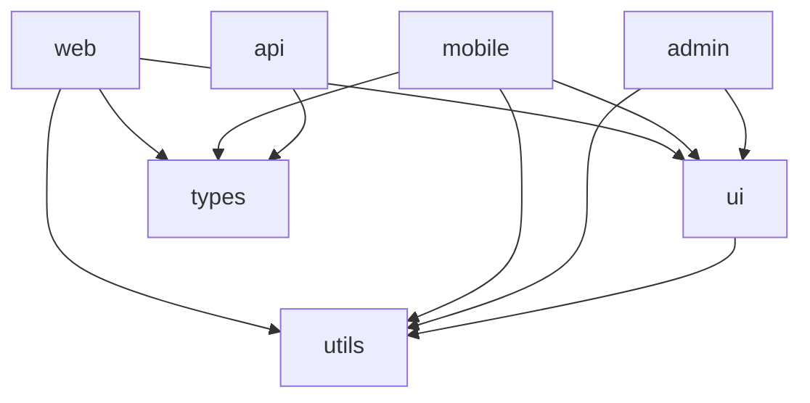

# Extended procedures and examples

Use [SKILL.md](SKILL.md) to select the task. Read only the sections it links for the current step.

<a id="section-1"></a>

## Claude Code Configuration (Workspace-Aware CLAUDE.md)

Place a root CLAUDE.md + per-package CLAUDE.md files:

```markdown
# /CLAUDE.md — Root (applies to all packages)

## Monorepo Structure
- apps/web       — Next.js customer-facing app
- apps/admin     — Next.js internal admin
- apps/api       — Express REST API
- packages/ui    — Shared React component library
- packages/utils — Shared utilities (pure functions only)
- packages/types — Shared TypeScript types (no runtime code)

## Build System
- pnpm workspaces + Turborepo
- Always use `pnpm --filter <package>` to scope commands
- Never run `npm install` or `yarn` — pnpm only
- Run `turbo run build --filter=...[HEAD^1]` before committing

## Task Scoping Rules
- When modifying packages/ui: also run tests for apps/web and apps/admin (they depend on it)
- When modifying packages/types: run type-check across ALL packages
- When modifying apps/api: only need to test apps/api

## Package Manager
pnpm — version pinned in packageManager field of root package.json
```

```markdown
# /packages/ui/CLAUDE.md — Package-specific

## This Package
Shared React component library. Zero business logic. Pure UI only.

## Rules
- All components must be exported from src/index.ts
- No direct API calls in components — accept data via props
- Every component needs a Storybook story in src/stories/
- Use Tailwind for styling — no CSS modules or styled-components

## Testing
- Component tests: `pnpm --filter @myorg/ui test`
- Visual regression: `pnpm --filter @myorg/ui test:storybook`

## Publishing
- Version bumps via changesets only — never edit package.json version manually
- Run `pnpm changeset` from repo root after changes
```

---

<a id="section-2"></a>

### GitHub Actions — Affected Only

```yaml
# .github/workflows/ci.yml
name: CI

on:
  push:
    branches: [main]
  pull_request:

jobs:
  affected:
    runs-on: ubuntu-latest
    steps:
      - uses: actions/checkout@v4
        with:
          fetch-depth: 0          # full history needed for affected detection

      - uses: pnpm/action-setup@v3
        with:
          version: 9

      - uses: actions/setup-node@v4
        with:
          node-version: 20
          cache: pnpm

      - run: pnpm install --frozen-lockfile

      # Turborepo remote cache
      - uses: actions/cache@v4
        with:
          path: .turbo
          key: ${{ runner.os }}-turbo-${{ github.sha }}
          restore-keys: ${{ runner.os }}-turbo-

      # Only test/build affected packages
      - name: Build affected
        run: turbo run build --filter=...[origin/main]
        env:
          TURBO_TOKEN: ${{ secrets.TURBO_TOKEN }}
          TURBO_TEAM: ${{ vars.TURBO_TEAM }}

      - name: Test affected
        run: turbo run test --filter=...[origin/main]

      - name: Lint affected
        run: turbo run lint --filter=...[origin/main]
```

<a id="section-3"></a>

## Dependency Graph Visualization

Generate a Mermaid diagram from your workspace:

```bash
# Generate dependency graph as Mermaid
cat > scripts/gen-dep-graph.js << 'EOF'
const { execSync } = require('child_process');
const fs = require('fs');

// Parse pnpm workspace packages
const packages = JSON.parse(
  execSync('pnpm ls --depth -1 -r --json').toString()
);

let mermaid = 'graph TD\n';
packages.forEach(pkg => {
  const deps = Object.keys(pkg.dependencies || {})
    .filter(d => d.startsWith('@myorg/'));
  deps.forEach(dep => {
    const from = pkg.name.replace('@myorg/', '');
    const to = dep.replace('@myorg/', '');
    mermaid += `  ${from} --> ${to}\n`;
  });
});

fs.writeFileSync('docs/dep-graph.md', '```mermaid\n' + mermaid + '```\n');
console.log('Written to docs/dep-graph.md');
EOF
node scripts/gen-dep-graph.js
```

**Example output:**



---
