# Nexus Apex Walkthrough — Visualising the Workflow and What Happens

**Purpose:** Human-facing document that illustrates, phase by phase, what happens when `/nexus apex` runs — which agent produces what, where the workflow stops or branches, and how to read the topology.
**Read when:** First-time apex users, when explaining the recipe to a team, when reviewing per-phase responsibilities, or when locating "where am I now?" during trouble.
**Companion:** The technical contract is in `apex-recipe.md`; this document is its narrative visualisation.

---

## 1. End-to-end Overview

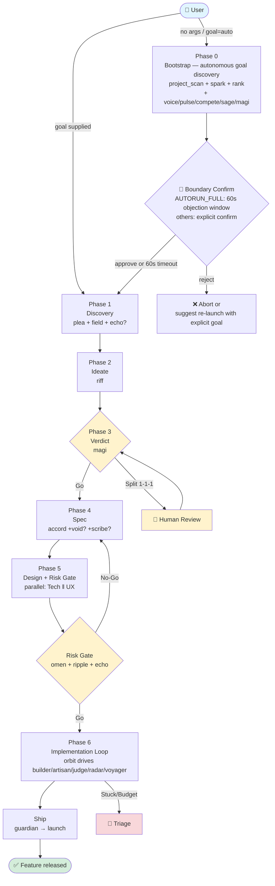

**Colour legend**: 🟦 entry / 🟩 done / 🟨 decision gate / 🟥 escalation

---

## 2. Per-phase Storyboard

### Phase 0: Bootstrap — "Even pick what to build, autonomously" (autonomous mode only)

The phase that runs only when `/nexus apex` is invoked with no arguments. From project state + real feedback + KPI/competitive signals it autonomously surfaces "what should we build next?", ranks candidates with ICE/RICE, picks #1, and asks for nothing more than a final go-ahead from the human.

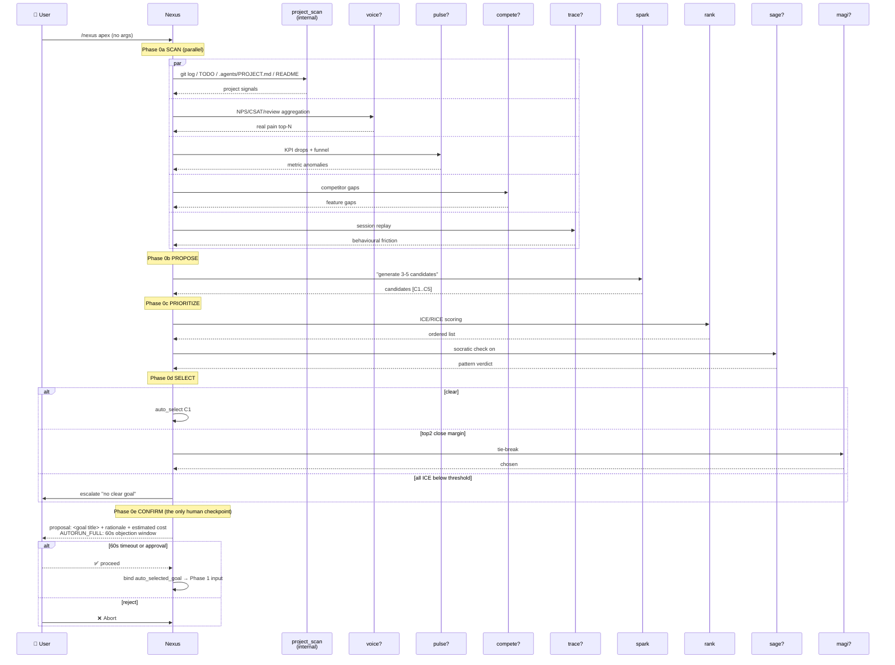

**What happens (concrete example: launching apex with no args on an existing product)**

```yaml
# Phase 0a SCAN result (collected in parallel within ~15 minutes)
project_scan:
  - "feature flag `comments_v2` shipped 3 weeks ago, not yet removed"
  - "TODO: refactor NotificationService — mentioned twice in CLAUDE.md"
  - "open issue #142: search is slow (3 weeks old, 5 reactions)"
voice:
  - top_pain: "too many notifications" (NPS detractor 32%)
  - top_request: "comment editing" (feature_request_count=18)
pulse:
  - "Settings → Notification funnel drop-off +12% (vs last month)"
  - "DAU monthly trend -3%"
compete:
  - "Competitor X has @mentions + reply threads; we have plain comments only"

# Phase 0b PROPOSE (spark)
candidates:
  C1: "fine-grained user controls for notification frequency"  # voice + pulse driven
  C2: "comment editing + history"                              # voice driven
  C3: "search performance improvement"                         # project_scan driven
  C4: "@mentions + reply threads"                              # compete driven
  C5: "cleanup of comments_v2 flag"                            # project_scan driven

# Phase 0c PRIORITIZE (rank, RICE auto-selected)
ranking:
  1. C1: RICE = 84  (Reach 8000 × Impact 2 × Confidence 0.85 / Effort 1.6)
  2. C4: RICE = 62
  3. C2: RICE = 45
  4. C3: RICE = 38
  5. C5: RICE = 12
sage_check:
  C1: "Not vanity-metric chasing — driven by real NPS. Constructive."

# Phase 0d SELECT
selected: C1 (margin > 10%)

# Phase 0e CONFIRM (AUTORUN_FULL)
proposal_to_user: |
  📍 Auto-selected goal: "Fine-grained user controls for notification frequency"

  Rationale:
    - voice: 32% of NPS detractors say "too many notifications"
    - pulse: Settings → Notification funnel drop-off +12% (vs last month)
    - DAU -3% trend is consistent with notification fatigue hypothesis

  Estimated cost: 14-18 agents / 2.5-3h / Standard scope, includes UI surface

  If no objection within 60 seconds, Phase 1 launches automatically.
  Type anything to stop.
  To specify a different goal directly:
    /nexus apex implement comment editing instead of notification settings

# 60s elapsed → bind to Phase 1
phase1_input:
  goal: "fine-grained user controls for notification frequency"
  scope: Standard
  ui_surface: true
```

**Key point**: from here on, the workflow runs to Ship with zero human input. Risk Gate / orbit circuit breaker / Triage fire only on failure, returning to the human only when truly necessary.


### Phase 1: Discovery — "What does the user actually want?"

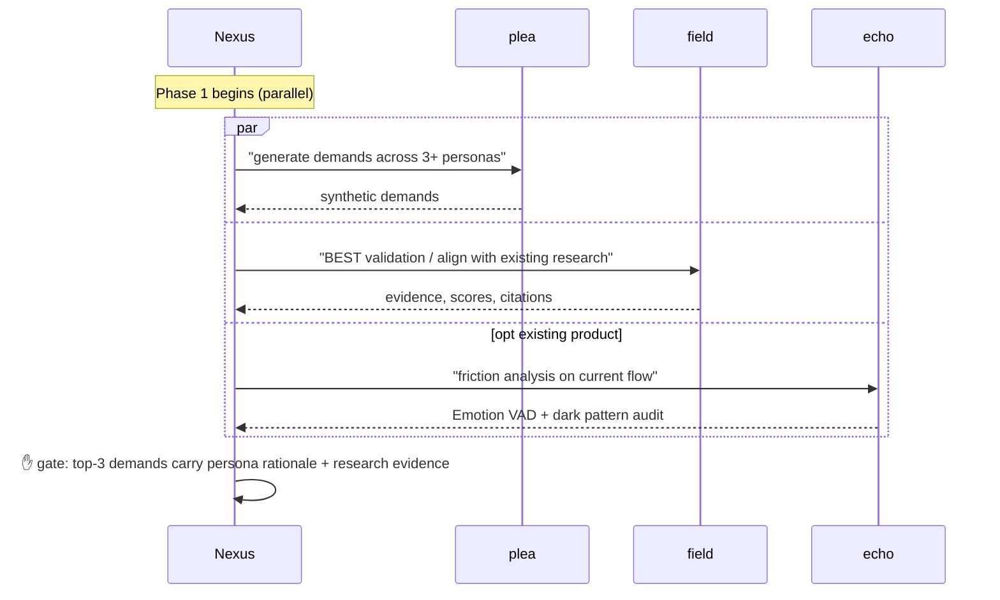

**What happens (concrete example: task-comments feature)**

| Agent | Sample output |
|---|---|
| plea | Beginner persona: "I can't join the conversation if I don't know how @mentions work"<br>Power user: "I want to react lightly with emoji"<br>External-contractor persona: "I want to see comment edit history" |
| field | "Industry median NPS lift for comment features is +12pt (study N=320)"<br>"@mention learning cost: 2.3 sessions on average" |
| echo (optional) | Existing comment area Valence -0.3, Confusion high |

---

### Phase 2: Ideate — "Diverge then converge"

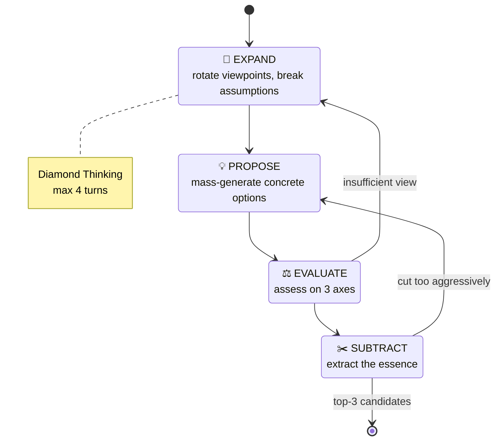

**What happens**

```
riff session: 4 turns
  Turn 1 EXPAND   → 12 ideas (voice / video / AI summarisation / translation …)
  Turn 2 PROPOSE  → 7 concrete prototypes (comments+reactions, AI summary, etc.)
  Turn 3 EVALUATE → narrow to 3 candidates (technical / UX / business — 3 axes)
  Turn 4 SUBTRACT → confirm "comments + @mentions + reactions" as the MVP
```

---

### Phase 3: Verdict — "Decide via Logos / Pathos / Sophia"

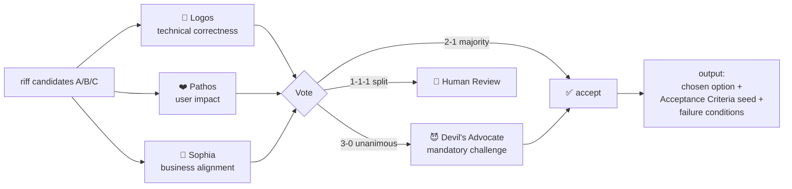

**What happens**

```yaml
magi_verdict:
  selected: "comments + @mentions + reactions (MVP)"
  votes:
    Logos:  Approve (confidence 0.85) "low technical risk; existing WebSocket reusable"
    Pathos: Approve (confidence 0.92) "directly resolves beginner Confusion"
    Sophia: Approve (confidence 0.78) "expects +15% engagement; ROI break-even ~8 weeks"
  consensus: 3-0 unanimous
  devils_advocate:
    challenge: "@mention notifications could become noise"
    mitigation_required: "include a notification frequency cap in the AC"
  acceptance_criteria_seed:
    - comment post P95 < 800ms
    - @mention notifications: max 5 per user per hour
    - 6 reaction types; no custom emoji in MVP
    - WCAG 3.0 Bronze pass
```

---

### Phase 4: Spec — "Lower the verdict into an implementable spec"

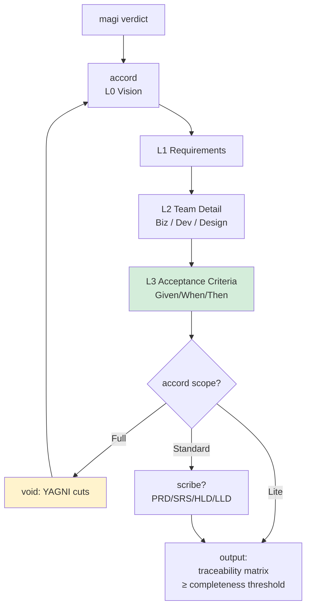

**What happens**

```
accord(scope=Standard) output:
  L0 Vision      "Communication without friction"
  L1 Requirements R-01..R-08 (functional) + NR-01..NR-04 (non-functional)
  L2 Team Detail
    Biz   : success metrics, stakeholders, competitive comparison
    Dev   : 5 APIs + 3 DB tables
    Design: 4 screens, 12 states
  L3 AC: 31 Given/When/Then items (orbit later converts these into the loop contract)
  Traceability: R↔AC completeness 91% (Standard threshold ≥85%, pass)
```

---

### Phase 5: Design + Risk Gate — "Design in parallel, gate on three axes"

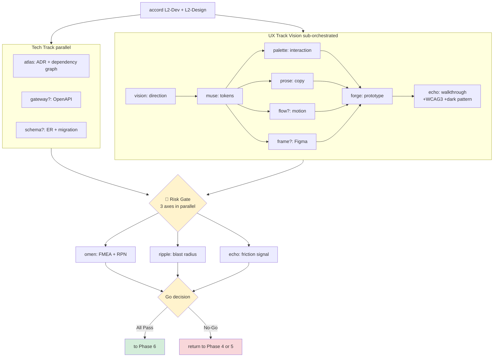

**Parallelism point**: Tech and UX run **simultaneously** as independent tracks. The Risk Gate also evaluates 3 agents in parallel. This keeps the phase count at 6 while maximising specialisation.

**What happens**

| Track | Output |
|---|---|
| atlas | ADR-0042: "Comments reuse the existing WebSocket Gateway; do not introduce a new queue" |
| gateway | OpenAPI for `POST /comments`, `POST /comments/{id}/reactions`, … |
| schema | `comments`, `comment_reactions`, `mentions` tables + indexes |
| vision | "Calm UI + light motion" direction; minimal trend application |
| muse | spacing tokens (4/8/12/16), colour palette, dark mode |
| palette | keyboard ops, a11y, @mention learning path |
| prose | empty state "No comments yet — be the first to speak", and 30 other copy strings |
| forge | working React prototype |
| echo | Valence +0.4, Confusion low, WCAG3 Bronze 3.7, dark pattern 0 |
| omen | High RPN: ❶ notification flood (mitigated) ❷ N+1 query (mitigation needed) |
| ripple | Conditional-Go: 14 files affected via existing WebSocket usage; coverable by tests |

**Sample Risk Gate decision**

```yaml
risk_gate_decision:
  omen: PASS (high_rpn=0, mitigation=2)
  ripple: CONDITIONAL_GO (blast_radius=14 files, mitigation=add 6 tests)
  echo: PASS (valence=+0.4, wcag=3.7, dark_pattern=0)
  plea_echo_divergence: NONE (synthetic demands aligned with prototype reactions)
  verdict: PROCEED to Phase 6
  injected_constraints:
    - "Add N+1 query mitigation to AC in Phase 6"
    - "Mandate regression tests covering the 14-file blast radius in Phase 6"
```

---

### Phase 6: Implementation Loop — "Orbit drives an autonomous loop on Codex CLI"

**Important**: the Phase 5 → Phase 6 boundary is also an **engine boundary**. Phases 0-5 run on Claude Code under Nexus, but Phase 6 alone is **fixed to Codex CLI** by Apex spec. Orbit drives every implementation agent via Codex's `spawn_agent` / `wait_agent` / `close_agent`.

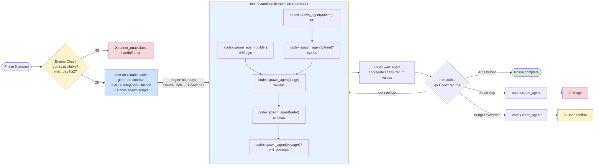

**Why Codex CLI is fixed**:

| Aspect | Reason |
|---|---|
| Iteration count | 4-8 cycles × 4-7 spawns = **16-56 spawns** is the typical range. Codex CLI subagents are tuned for high-frequency autonomous coding |
| Context isolation | Each spawn gets a fresh context window; **context rot** does not propagate to the main Claude Code session |
| File ownership | `agents.max_depth` plus explicit `spawn_agent`/`close_agent` lifecycle make per-branch ownership separation cheap |
| Portability | Phase 5 → 6 becomes an explicit engine boundary, so swapping the runner later does not disturb upstream phases |

**Behaviour on prerequisite check failure**: orbit does not silently fall back to the Claude Code Agent tool. Apex's cost and convergence model assumes Codex execution, so when the engine is unreachable orbit **stops with an explicit error** (emits `#TODO(agent): re-enable Codex CLI and retry`).

**Metrics orbit watches continuously**

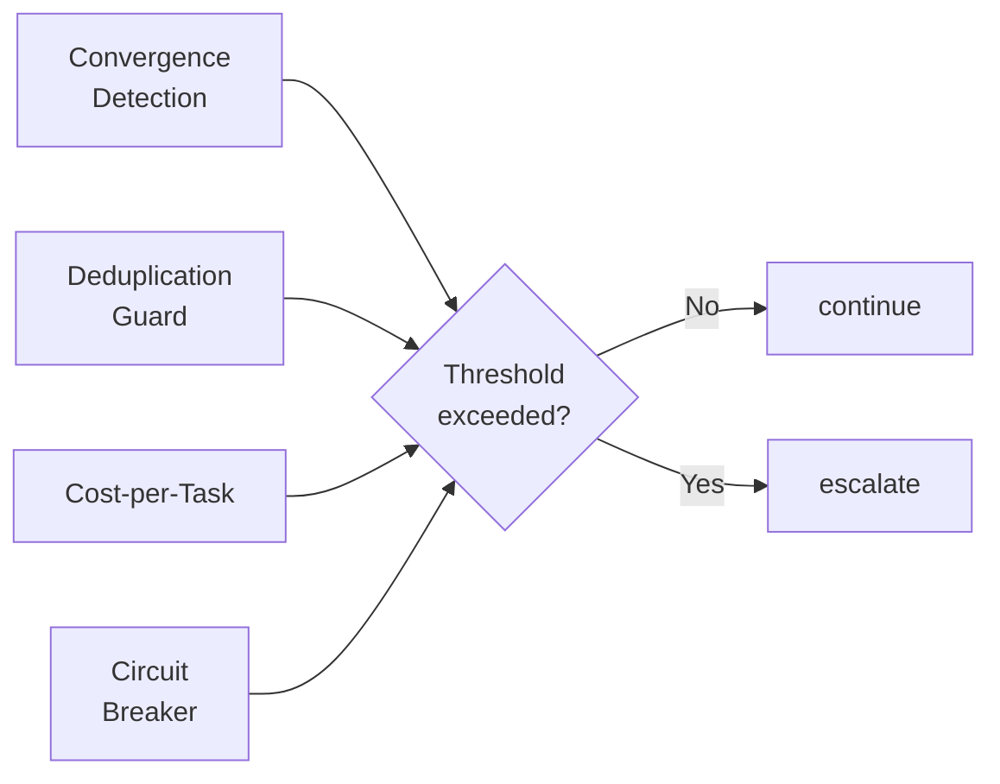

**What happens (sample iterations)**

```
Iteration 1
  builder   : POST /comments + DB persistence  → SUCCESS
  artisan   : CommentList + Composer            → SUCCESS
  vitrine  : 8 stories                         → SUCCESS
  judge     : 1 finding "authorisation logic is thin"   → BLOCKED
  → orbit: re-delegate to builder

Iteration 2
  builder   : added authorisation middleware    → SUCCESS
  judge     : OK                                → SUCCESS
  radar     : 12 unit tests / 1 fail             → BLOCKED
  → orbit: re-delegate to builder (share failing test)

Iteration 3
  builder   : edge-case fix                     → SUCCESS
  radar     : all PASS                          → SUCCESS
  voyager   : E2E 4 scenarios × 3 personas     → 1 failure
  → orbit: re-delegate to artisan

Iteration 4
  artisan   : focus-control fix                 → SUCCESS
  voyager   : all PASS                          → SUCCESS
  orbit     : all 31 AC satisfied               → DONE

cost-per-task: $4.20 (within $8.00 budget)
convergence: 4 iterations / threshold 8
```

---

### Ship — "Commit → Release"

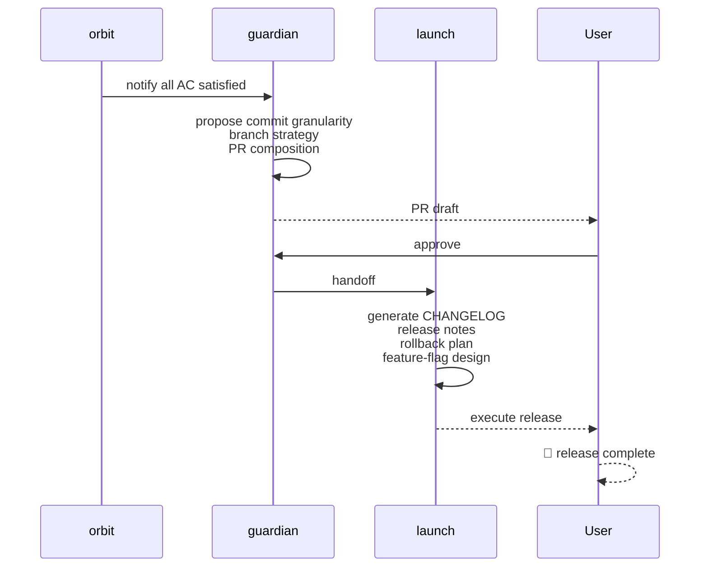

---

## 3. Failure and Rollback Flow

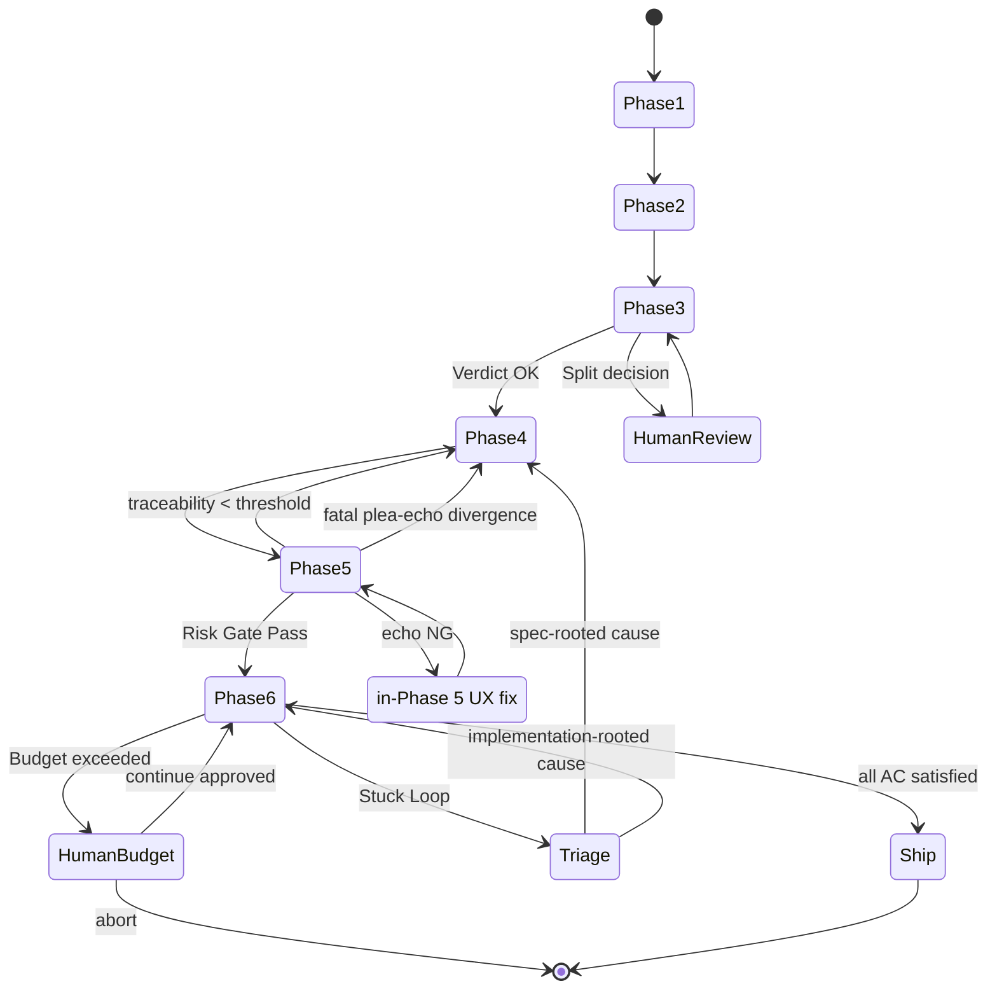

---

## 4. Two-tier Hub Topology

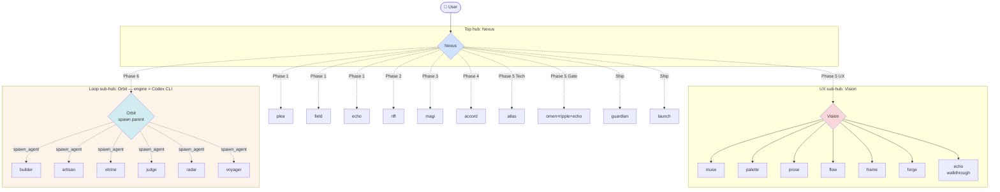

**Design rationale**: top-level Nexus directly fans out to ~10 agents only; the 9 UX agents hide under Vision and the 6 loop agents hide under Orbit. This preserves the "specialists ≤ 7-10 per orchestrator" principle. **Furthermore, LOOPHUB executes on Codex CLI and is fully isolated from the Claude Code session's context budget.**

---

## 5. Time and Cost Profile

```mermaid
gantt
    title apex execution timeline (autonomous mode + Standard profile estimate)
    dateFormat HH:mm
    axisFormat %H:%M

    section Phase 0 Bootstrap
    project_scan (parallel)      :p0a, 00:00, 5m
    voice/pulse/compete? (par)   :p0b, 00:00, 8m
    spark (3-5 candidates)       :p0c, after p0b, 5m
    rank + sage?                 :p0d, after p0c, 4m
    boundary confirm (60s window):p0e, after p0d, 1m
    section Discovery
    plea (parallel)              :a1, after p0e, 8m
    field (parallel)        :a2, 00:00, 10m
    echo? (parallel)             :a3, 00:00, 6m
    section Ideate
    riff (4 turns)               :b1, 00:10, 8m
    section Verdict
    magi (engine mode)           :c1, 00:18, 5m
    section Spec
    accord (L0-L3)               :d1, 00:23, 12m
    void? / scribe?              :d2, 00:35, 6m
    section Design (parallel)
    atlas + gateway? + schema?   :e1, 00:41, 15m
    vision → muse → palette/prose/flow → forge → echo :e2, 00:41, 25m
    section Risk Gate
    omen + ripple + echo         :f1, 01:06, 8m
    section Implementation Loop
    orbit + builder/artisan/judge/radar/voyager (4-8 iter) :g1, 01:14, 60m
    section Ship
    guardian + launch            :h1, 02:14, 10m
```

| Profile | Agent count | Time estimate | Cost estimate | Use case |
|---|---|---|---|---|
| **Lite** | 8-10 | 60-90 min | Low | Backend-only feature, accord=Lite |
| **Standard** | 14-18 | 2-3 hours | Medium | Typical UI-bearing feature |
| **Full** | 20-25 | 3-5 hours | High | Greenfield, accord=Full, Figma integration, multi-locale |
| **+Phase 0 (autonomous mode)** | +4-8 | +15-25 min | +10-20% | Goal also auto-selected when launched with no args |

> Note: times depend on network and model latency. Each phase has a verification gate, so this is **total elapsed time**, not the bandwidth of parallel processing.

---

## 6. What Remains as Artefacts

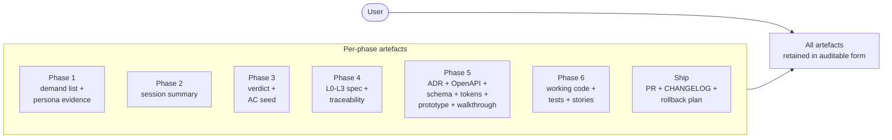

**Primary artefacts that persist after implementation**:
- `docs/specs/<feature>.md` (accord)
- `docs/adr/ADR-NNNN.md` (atlas)
- `docs/api/openapi.yaml` (gateway)
- `docs/design/tokens.json` (muse)
- Storybook (vitrine)
- E2E persona scenarios (voyager)
- Release notes + rollback procedure (launch)

All of these are auto-generated as apex by-products, so what remains is not just **"working code"** but **"explainable functionality"**.

---

## 7. Invocation Examples (copy-pasteable)

### Autonomous mode (fully self-driving) — "Even the goal is automatic"

```bash
# No args: Phase 0 runs, auto-selects the goal → 60s objection window → auto-proceeds
/nexus apex

# Explicitly opt into autonomous mode (same as above)
/nexus apex goal=auto

# Autonomous mode with stricter confirm (skip the 60s timeout, require explicit Y/N)
/nexus apex mode=AUTORUN
```

### Goal-supplied mode — "We already know what to build"

```bash
# Minimum
/nexus apex add task-comments feature

# Mode override (less prompting, auto-progress)
/nexus apex add task-comments feature mode=AUTORUN_FULL

# Explicit scope hints (relayed to accord)
/nexus apex add task-comments feature scope=Standard ui=true api_change=true db_change=true
```

### Stopping mid-flight

```bash
# In autonomous mode, any input within the 60s window stops immediately
> /nexus apex
... Proposal: "fine-grained notification controls" ... stop within 60s by typing anything
> stop                    # ← any input aborts
Aborted. To choose differently:
  /nexus apex specify a different goal directly
```

After execution, Nexus returns a `## Nexus Execution Report` with the Phase 0 selection log plus Status / Output / Handoff for Phases 1-6. In autonomous mode, the rationale for `auto_selected_goal` and its `rejected_alternatives` are also persisted, so "why we did not pick a different feature" remains auditable.

---

## 8. Related Documents

| Use case | File |
|---|---|
| Technical contract (agent-facing) | `apex-recipe.md` |
| This document (visual / human-facing) | `apex-walkthrough.md` |
| Recipe overview | Recipes table / Subcommand Dispatch in `nexus/SKILL.md` |
| Sub-hub design rationale | `agent-chains.md`, `orchestration-patterns.md` |
| Guardrails | `guardrails.md`, `error-handling.md` |
