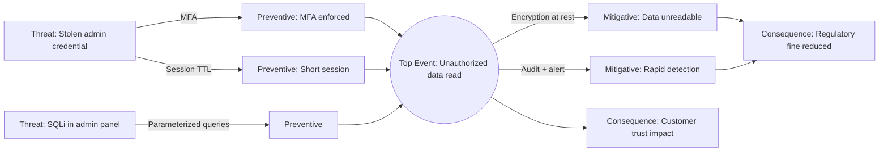

# Bowtie Diagram Reference

Purpose: A single-page risk picture that places one Top Event at the center, with Threats and their Preventive barriers on the left and Consequences with their Mitigative barriers on the right. Bowties are the communication artifact of choice when both pre-event and post-event controls must be visible to non-technical stakeholders, when barrier effectiveness must be argued, or when incident response playbooks need layered-defense grounding.

## Scope Boundary

- **omen `bowtie`**: threat × top-event × consequence mapping with preventive and mitigative barriers, escalation factors, and barrier effectiveness notes. Stakeholder-facing.
- **omen `faulttree` (elsewhere)**: deductive decomposition of the *left* side — use FTA to generate threats that feed the bowtie.
- **Event Tree Analysis / `bowtie` right side**: inductive forward reasoning from the top event to outcomes — use to generate consequence branches that feed the bowtie.
- **Triage (elsewhere)**: owns post-incident response execution; bowtie informs the playbook but does not replace it.
- **Beacon (elsewhere)**: observability and detection barrier instrumentation; bowtie surfaces *which* barriers need telemetry, Beacon builds them.
- **Sentinel / Breach (elsewhere)**: adversarial threats; bowtie can use attack trees as left-side threats, but design of the threats themselves lives with Sentinel / Breach.

## Core Terminology

| Term | Meaning | Example |
|------|---------|---------|
| Hazard | Inherent energy / condition in the system | Persisted user payment data |
| Top Event | Loss of control over the hazard | Unauthorized read of payment data |
| Threat | Mechanism that could cause the top event | Stolen admin credential |
| Consequence | Outcome after the top event | Regulatory fine, customer churn |
| Preventive barrier | Control that stops threat → top event | MFA on admin account |
| Mitigative barrier | Control that reduces top event → consequence | Encryption at rest + audit alerting |
| Escalation factor | Condition that degrades a barrier | Shared admin account |
| Escalation-factor barrier | Control on an escalation factor | Personal-account policy + review |

## Workflow

```
1. HAZARD        state the inherent hazard (energy / asset under stewardship)
2. TOP EVENT     state the loss-of-control moment in one sentence, measurable
3. THREATS       list 3–7 plausible threat pathways (left)
                 pull from FTA cut sets, STRIDE, or incident history
4. CONSEQUENCES  list 3–5 outcome classes (right)
                 group by stakeholder: user, business, regulator, brand
5. BARRIERS      for each threat → preventive barrier chain
                 for each consequence → mitigative barrier chain
                 at least 2 independent barriers per critical path
6. ESCALATION    per barrier, list conditions that degrade it
                 attach an escalation-factor barrier to each
7. EFFECTIVENESS rate barriers as Strong / Adequate / Weak / Absent
                 and annotate owner + evidence (test, audit, monitor)
8. HANDOFF       feed weak/absent barriers to Triage (runbooks),
                 Beacon (detection), and Magi (investment trade-offs)
```

## Barrier Types

| Type | Characteristic | Typical failure mode |
|------|----------------|----------------------|
| Hardware / engineered | Passive, always-on (encryption, WAF, rate-limiter) | Misconfiguration, drift |
| Software control | Active code path (validation, feature flag, quota) | Bug, bypass, silent disable |
| Procedural | Documented human step (runbook, checklist, review) | Skipped, outdated |
| Organizational | Policy / training / structure (separation of duties) | Not enforced, turnover loss |
| Detective | Observes and alerts (SIEM, anomaly detection) | Noisy, missed signal |
| Recovery | Restores post-event (backup, failover, rollback) | Never rehearsed, stale |

Strong bowties mix *layers*: at least one engineered + one procedural + one detective per critical path. A chain of same-type barriers tends to fail together (common-cause failure, same training gap, same misconfigured platform).

## Template (Mermaid)



For stakeholder decks, a draw.io bowtie template (threats stacked left, consequences stacked right, barriers as vertical bars crossing the centerline) reads better than Mermaid. Mermaid is better when the artifact lives in PR / docs.

## Swiss Cheese Parallels

Reason's Swiss Cheese model is the mental metaphor; bowtie is its quantifiable diagram:

- Each slice = a barrier.
- Each hole = a defect (escalation factor, drift, bypass).
- Incident = holes aligning across slices.
- Bowtie forces you to *name* each slice and each hole — Swiss Cheese alone does not.

If a critical path has only one barrier, you have a one-slice cheese — the hole *is* the incident. Add at least one more independent layer, of a different type, before shipping.

## Linkage

- **FTA (left side)**: the minimal cut sets from `faulttree` become the threat entries on the left. A bowtie is a compressed FTA + ETA stitched at the top event.
- **ETA (right side)**: an event tree from the top event, branching on barrier success/fail, produces the consequence set. Each ETA leaf = one bowtie consequence.
- **Bowtie → Triage**: each weak mitigative barrier → runbook step ownership.
- **Bowtie → Beacon**: each detective barrier → SLI / alert definition.

## Anti-Patterns

- Top event stated as a cause ("SQL injection") or as a consequence ("data breach") — it must be the *loss of control* moment.
- Listing controls as barriers without evidence they actually operate — rate barriers Absent until tested.
- Chaining three procedural barriers and calling it defense-in-depth — same type, same failure mode.
- Omitting escalation factors — the barrier exists, but the condition that degrades it is invisible.
- Letting the bowtie age without review — barriers drift; schedule a quarterly revalidation.
- Using bowtie for broad hazard scan — one top event per diagram. For many hazards, produce many bowties, not one crowded mega-diagram.
- Copying a generic industry bowtie without tailoring — barriers must be owned by someone on *your* team.

## Handoff

- **To Triage**: weak / absent mitigative barriers become playbook entries with explicit owners and trigger conditions.
- **To Beacon**: detective barriers need SLI + alert + dashboard; hand off the signal contract.
- **To Magi**: when barrier investment choices compete (add MFA vs add WAF), hand the bowtie + cost to Magi for trade-off arbitration.
- **To Sentinel / Breach**: left-side threats feed adversarial test cases; weak preventive barriers become red-team targets.
- **To Radar**: each barrier claim becomes a verification test (does the barrier actually fire under the threat condition?).
