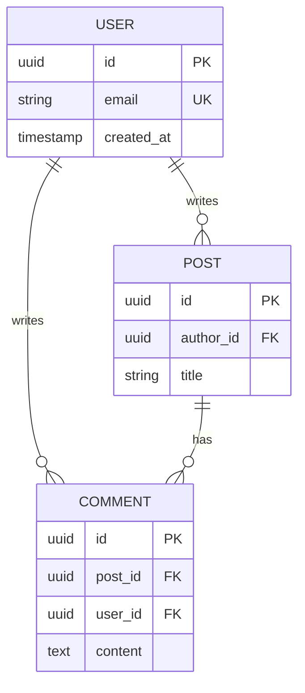

# Schema Examples And Templates

Purpose: Use this file when you need concrete schema, migration, ORM, or ER diagram examples.

Contents:
1. Entity design template
2. Common modeling patterns
3. Migration templates
4. Index examples
5. DB-specific examples
6. Framework snippets
7. ER diagram example
8. Output quality examples

## Entity Design Template

```markdown
## Entity: [EntityName]

**Purpose:** [What this entity represents]
**Owner:** [Which domain/service owns this]

### Attributes

| Column | Type | Constraints | Description |
|--------|------|-------------|-------------|
| id | UUID/BIGINT | PK | Primary identifier |
| created_at | TIMESTAMP | NOT NULL, DEFAULT NOW() | Creation time |
| updated_at | TIMESTAMP | NOT NULL | Last modification |
| [column] | [type] | [constraints] | [description] |

### Relationships

| Related Entity | Cardinality | FK Column | On Delete |
|----------------|-------------|-----------|-----------|
| [Entity] | 1:N / N:1 / N:M | [fk_column] | CASCADE / SET NULL / RESTRICT |

### Indexes

| Name | Columns | Type | Purpose |
|------|---------|------|---------|
| idx_[table]_[column] | [columns] | BTREE/GIN/etc | [Query pattern supported] |
```

## Common Modeling Patterns

| Pattern | Use case | Shape |
|--------|----------|-------|
| Soft delete | Recoverable deletion | `deleted_at TIMESTAMP NULL` |
| Audit trail | Change history | separate `_history` table |
| Self-reference | Trees and hierarchies | `parent_id` FK to same table |
| Junction table | N:M relationships | two FKs, often composite PK |
| JSON column | Truly dynamic attributes | `metadata JSONB` |
| Polymorphic replacement | Few parent types | nullable FKs + `CHECK` or dedicated child tables |

## Migration Templates

### Create Table

```sql
-- Migration: create_[table_name]

-- Up
CREATE TABLE [table_name] (
    id UUID PRIMARY KEY DEFAULT gen_random_uuid(),
    [columns...],
    created_at TIMESTAMP NOT NULL DEFAULT NOW(),
    updated_at TIMESTAMP NOT NULL DEFAULT NOW()
);

CREATE INDEX idx_[table]_[column] ON [table_name]([column]);

-- Down
DROP TABLE IF EXISTS [table_name];
```

### Add Column

```sql
-- Up
ALTER TABLE [table_name]
ADD COLUMN [column_name] [TYPE] [CONSTRAINTS];

-- Down
ALTER TABLE [table_name]
DROP COLUMN IF EXISTS [column_name];
```

### Add Foreign Key

```sql
-- Up
ALTER TABLE [child_table]
ADD CONSTRAINT fk_[child]_[parent]
FOREIGN KEY ([column]) REFERENCES [parent_table]([column])
ON DELETE [CASCADE|SET NULL|RESTRICT];

-- Down
ALTER TABLE [child_table]
DROP CONSTRAINT IF EXISTS fk_[child]_[parent];
```

### Safe Column Rename

```sql
-- Phase 1: Expand
ALTER TABLE [table_name] ADD COLUMN [new_name] [TYPE];
UPDATE [table_name] SET [new_name] = [old_name];

-- Phase 2: Application dual-write / verification

-- Phase 3: Contract
ALTER TABLE [table_name] DROP COLUMN [old_name];
```

## Index Examples

### Composite Index Rule

```markdown
## Composite Index: idx_[table]_[col1]_[col2]

**Columns:** (col1, col2, col3)

**Effective for:**
- WHERE col1 = ? ✅
- WHERE col1 = ? AND col2 = ? ✅
- WHERE col1 = ? AND col2 = ? AND col3 = ? ✅
- ORDER BY col1, col2 ✅

**Not effective for:**
- WHERE col2 = ? ❌
- WHERE col3 = ? ❌
- ORDER BY col2, col1 ❌
```

## DB-Specific Examples

### PostgreSQL: JSONB + GIN

```sql
CREATE TABLE products (
  id UUID PRIMARY KEY DEFAULT gen_random_uuid(),
  name VARCHAR(255) NOT NULL,
  attributes JSONB DEFAULT '{}',
  tags TEXT[] DEFAULT '{}'
);

CREATE INDEX idx_products_attributes ON products USING GIN (attributes);
CREATE INDEX idx_products_tags ON products USING GIN (tags);
CREATE INDEX idx_products_active ON products (name) WHERE deleted_at IS NULL;
```

### MySQL: JSON + Virtual Column Index

```sql
CREATE TABLE products (
  id CHAR(36) PRIMARY KEY,
  name VARCHAR(255) NOT NULL,
  attributes JSON,
  category VARCHAR(100) AS (JSON_UNQUOTE(attributes->'$.category')) STORED,
  INDEX idx_category (category)
);
```

### SQLite: JSON1 / FTS5

```sql
CREATE TABLE products (
  id TEXT PRIMARY KEY,
  name TEXT NOT NULL,
  attributes TEXT
);

CREATE VIRTUAL TABLE docs USING fts5(title, body);
```

## Framework Snippets

### Prisma

```prisma
model User {
  id        String   @id @default(uuid())
  email     String   @unique
  name      String?
  posts     Post[]
  createdAt DateTime @default(now())
  updatedAt DateTime @updatedAt

  @@index([email])
  @@map("users")
}
```

### TypeORM

```typescript
@Entity('users')
export class User {
  @PrimaryGeneratedColumn('uuid')
  id: string;

  @Column({ unique: true })
  @Index()
  email: string;
}
```

### Drizzle

```typescript
export const users = pgTable('users', {
  id: uuid('id').primaryKey().defaultRandom(),
  email: varchar('email', { length: 255 }).notNull().unique(),
}, (table) => ({
  emailIdx: index('idx_users_email').on(table.email),
}));
```

## ER Diagram Example



## Output Quality Examples

### Good Schema Output

```sql
CREATE TABLE orders (
    id UUID PRIMARY KEY DEFAULT gen_random_uuid(),
    user_id UUID NOT NULL REFERENCES users(id) ON DELETE RESTRICT,
    status VARCHAR(20) NOT NULL DEFAULT 'pending'
        CHECK (status IN ('pending', 'confirmed', 'shipped', 'delivered', 'cancelled')),
    total_amount DECIMAL(10, 2) NOT NULL,
    created_at TIMESTAMP NOT NULL DEFAULT NOW(),
    updated_at TIMESTAMP NOT NULL DEFAULT NOW()
);

CREATE INDEX idx_orders_user_id ON orders(user_id);
CREATE INDEX idx_orders_status ON orders(status) WHERE status != 'cancelled';
```

### Bad Schema Output

```sql
CREATE TABLE orders (
    id INT,
    user INT,
    status TEXT,
    amount FLOAT
);
```
